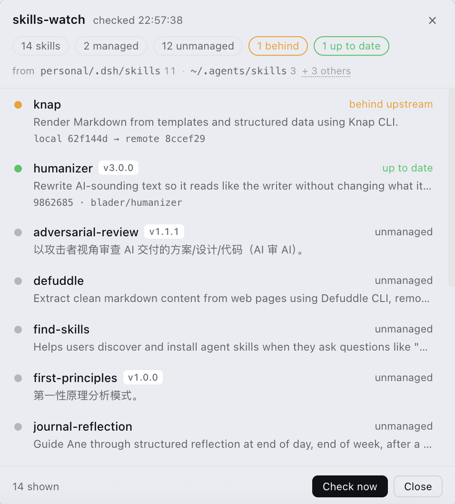

<div align="center">

# 🛰️ skills-watch

[](CHANGELOG.md)
[](LICENSE)
[](#)
[](#)

### 盯着你本机装的 Agent Skill，指出哪一个已经落后于它的上游仓库。



徽章挂在会话标题栏右侧；点击在右下角展开面板 —— 每个 skill 的作用、版本、来源与检测状态。面板配色走 DSH 主题 token，跟随明暗主题。

**[快速开始](#-快速开始) · [检测模型](#-检测模型) · [配置](#-配置) · [接口事实](#-dsh-接口事实) · [目录](#-目录)**

</div>

---

## 🚀 快速开始

```bash
cd ~/.dsh/profiles/web
pnpm add @lzsusc2019/skills-watch        # 本地未发布：pnpm add /path/to/skills-watch
```

**② 注册为 bundle** —— 编辑 `~/.dsh/profiles/web/package.json`：

```json
{ "dsh": { "profile": { "bundles": [
  "@deepseek-ai/dsh-base",
  "@deepseek-ai/dsh-web-app",
  "@lzsusc2019/skills-watch"
] } } }
```

> [!IMPORTANT]
> **只装依赖不加这一行，插件不会加载。** bundle 列表决定哪些包的 `cordis.patch.yml` 会被合并进组合树。

**③ 重启 DSH** —— profile 的包集合在启动时确定。

<details>
<summary><b>为什么是 profile 而不是 agent preset</b></summary>

本插件的 Host 半边**发布一个 service**，消费者是浏览器客户端 —— 位于任何 agent session 之外。按 DSH 组合规则，发布 service 的行放进 per-session 的 preset 会落到进程全局 realm，**第二个挂载该 preset 的会话会撞车**。所以它属于 host 平面：作为 bundle 打进 profile，而不是放进 `agent.cordis.yml`。

包内 `cordis.patch.yml` 声明的就是这一行：

```yaml
- insert:
    - id: skills-watch
      name: '@lzsusc2019/skills-watch'
```

`dsh plugin --profile web add <package>` 是同一件事的官方命令 —— 它把参数转发给 profile 目录里的 pnpm。

</details>

---

## 🔍 检测模型

skill 只有**在 `SKILL.md` 同目录存在 `.source.json`** 时才算「托管」，才进入检测。没有这个文件的一律 `unmanaged`，不参与检测，也不会被误报。

**过期判定：**

```
local_sha  ≠  git ls-remote <repo> <ref>  返回的对象 SHA
```

取的是 **commit 对象 SHA**，不是 ref 字符串 —— tag 重命名、分支改名都不会误判。缺省 ref 走 `HEAD`。

| 状态 | 含义 | 显示 |
|---|---|---|
| `up_to_date` | 托管，本地 SHA 与远端一致 | 绿点 · up to date |
| `behind` | 托管，本地 SHA 已落后 | 黄点 · behind upstream，附 `local xxx → remote yyy` |
| `unknown` | 托管，远端检查失败（离线 / 仓库名错 / 私有仓库无凭据） | 灰点 · check failed，附原因 |
| `unmanaged` | 没有 `.source.json` | 灰点 · unmanaged |

| 触发时机 | 行为 |
|---|---|
| 客户端挂载 | 自动跑一次 |
| 点击徽章 | 展开面板并重新检测 |
| 面板内 `Check now` | 重新检测 |

> [!NOTE]
> **没有后台定时器。** 不轮询，不做无谓请求；远端 SHA 在 Host 进程内缓存 24 小时。`unknown` 也**不会被当成过期** —— 离线时显示灰色而不弹提示，这是刻意的，避免误报。

<details>
<summary><b><code>.source.json</code> 字段</b></summary>

```json
{
  "repo": "blader/humanizer",
  "ref": "HEAD",
  "local_sha": "9862685f575c65a8247f90369951df1b3416e3d6",
  "synced_at": "2026-09-12T00:00:00Z"
}
```

| 字段 | 说明 |
|---|---|
| `repo` | `owner/name` 或完整 URL（`https://`、`git@`、`ssh://` 均接受） |
| `ref` | 分支 / tag / `HEAD`。缺省 `HEAD`，指向远端默认分支 —— 不用 `main`，避免命名差异 |
| `local_sha` | 本机当前所处的 commit |
| `synced_at` | 上次同步时间（目前仅记录，未参与判断） |

</details>

---

## ⚙️ 配置

### 扫描哪些目录

默认**镜像 DSH 自己的解析逻辑**（`@deepseek-ai/dsh-skill-filesystem` 的 `roots()`），而不是照某台机器的目录写死：

| # | 目录 | 来源 |
|---|---|---|
| 1 | `<projectRoot>/.dsh/skills` | 项目级 |
| 2 | `<projectRoot>/.agents/skills` | 项目级 |
| 3 | `<DSH_HOME>/skills` | 用户级，默认 `~/.dsh/skills` |
| 4 | `<DSH_AGENTS_HOME>/skills` | 用户级，默认 `~/.agents/skills` |
| 5 | `$DSH_BUNDLED_SKILL_DIR` | 打包技能，仅在该变量设置时扫 |

`<projectRoot>` 的确定方式与 DSH 一致：从工作目录向上找 `.git`，找到就取那一层；一直到文件系统根都没找到，就用工作目录本身。

**顺序有意义** —— 同名 skill 由靠前的目录胜出，去重后只保留一份。面板的 `from` 行显示每个目录实际贡献了几个 skill，被去重掉的标为 `duplicate`。

**工作目录来自当前会话。** Client 半边把会话的 `cwd`（读自 `useSessions` 的 `SessionSummary.cwd`）传给 Host 的 `list({ cwd })`，所以你在哪个仓库里工作，项目级 skill 就从那个仓库找 —— 不是从 DSH 进程启动时所在的目录。换工作区会重新解析。没有会话时回退到 Host 进程的 cwd。

### 两件刻意不默认包含的事

镜像 DSH 也意味着两样东西不在默认列表里，因为它们本就不在 DSH 的加载路径上：

- **`customSkillDirs`** —— 由每个 agent preset 自行声明（例如某插件把技能打进 preset 目录），profile 级插件看不到。需要就用 `extraRoots` 加。
- **`~/.claude/skills`** —— Claude Code 的目录，DSH 不从那里加载。同时用 Claude Code 并想一起盯，用 `extraRoots` 加。

两样都能在面板的 `from` 行里看出结果 —— 配错了是可见的，不是静默的。

### 配置键

| 键 | 默认 | 作用 |
|---|---|---|
| `roots` | 推断 | **完全替换**扫描列表；给了它就不再推断 |
| `extraRoots` | 无 | 追加到列表末尾，支持 `~` |
| `project` | 会话 cwd | 固定项目基准；给了它就不再跟随会话 |
| `home` | `$HOME` | `~` 展开与路径显示用的主目录 |
| `dshHome` | `$DSH_HOME` ?? `~/.dsh` | Harness home |
| `agentsHome` | `$DSH_AGENTS_HOME` ?? `~/.agents` | agents home |
| `bundledSkillDir` | `$DSH_BUNDLED_SKILL_DIR` | 打包技能目录 |
| `customSkillDirs` | 无 | preset 式的额外目录，追加 |
| `cacheTtlMs` | 24h | 远端 SHA 缓存时长 |
| `maxSummary` | 100 | 面板上描述压缩后的字符上限 |

`GITHUB_TOKEN` 目前**未使用**；私有仓库需要凭据时 `git ls-remote` 会失败并落到 `unknown`。

<details>
<summary><b>config 写法</b></summary>

在 `cordis.patch.yml` 的行里加 `config`：

```yaml
- insert:
    - id: skills-watch
      name: '@lzsusc2019/skills-watch'
      config:
        project: /Users/you/work          # 固定项目基准（替代会话 cwd 推导）
        extraRoots:                       # 追加到默认列表之后
          - ~/.claude/skills
        cacheTtlMs: 86400000
        maxSummary: 100
```

要把扫描列表完全接管，用 `roots` 代替 `extraRoots`：

```yaml
      config:
        roots:
          - /Users/you/work/.dsh/skills
          - /Users/you/.agents/skills
```

</details>

---

## 🚫 明确不做

- **不自动更新**任何 skill —— 插件只读，写操作需要单独的权限模型
- **不展示 diff** —— 只标状态，不展开变更内容
- **不支持 GitHub 以外的 Git 源** —— `git ls-remote` 本身通用，但地址归一化只覆盖 GitHub 简写
- **不处理本地手改过的 skill** —— 本地改动会让 `local_sha` 与远端不一致，此时显示 `behind`，这是已知的语义边界

---

## 📐 DSH 接口事实

<details>
<summary><b>技能根目录由 preset 声明，host 平面看不到</b></summary>

`@deepseek-ai/dsh-skill-filesystem` 是**每个 agent preset 注册一份**的（`cordis` preset 里那一行还带 `customSkillDirs`），所以它的扫描结果落在该 preset 的层里。profile 级的插件没有 agent scope，`ctx.skills.list()` 在那一层看到的是空 —— 这正是动态插件时代 `ctx.skills` 始终返回 `[]` 的原因。

所以 host 平面的插件要列 skill，只能自己扫文件系统，并且必须**镜像 DSH 的根目录解析**，否则只能对上自己那台机器。`findProjectRoot` 的算法就是向上找 `.git`，落到根就返回原 cwd。

另外 `ctx.skills` 与模型看到的 `<available_skills>` 目录也不是同一份数据 —— 后者含 system prompt 注入的部分。

</details>

<details>
<summary><b>槽位 props 里的 selector hook</b></summary>

`useSessions` / `useSession` 等是作为 slot prop 传进来的 hook：

```ts
export type SnapshotSelectorHook<T> = <S>(sel: (s: T) => S, eq?: (a: S, b: S) => boolean) => S;
```

它们只能从组件里调用。本项目用一个**仅在 prop 存在时渲染**的子组件承载它 —— hook 调用点无条件，条件性的是元素本身。`SessionSummary.cwd` 就是会话的工作目录。

</details>

再写同类插件可以直接照抄的一节。**全部内容在下面的折叠块里** —— 点开看细节。

<details>
<summary><b>Service 注入</b></summary>

`inject: ['fs', 'shell']` 拿到的是真实对象；`runtime.host.provides: []` 只表示**本插件没有向外部发布 service**，不代表没拿到 —— 这两件事容易看混。

四个 Service 的 `typeof` 实测全为 `object`：

```
ctx.skills → object   ctx.fs    → object
ctx.shell  → object   ctx.timer → object
```

</details>

<details>
<summary><b><code>ctx.fs</code> —— 没有 mtime</b></summary>

```ts
// @deepseek-ai/dsh-fs
export interface FsInfo {
  version: FsVersion;                        // 不透明的新鲜度标识，不是时间戳
  type: 'file' | 'directory' | 'other';
  size?: number;
}
```

`stat` **不返回 mtime**，`version` 也无法折算成时间。任何「文件多少天没改」的判定在这条路径上都做不了。

可用的是 `resolve(path)` → `FsTarget`、`listDir(target)` → `FsDirEntry[]`（每项含 `name` / `type` / `target`）、`readText(target)` → `string`。

</details>

<details>
<summary><b><code>ctx.shell</code> —— 请求与结果的确切形状</b></summary>

```ts
// @deepseek-ai/dsh-shell
export interface ShellExecRequest {
  command: string;          // 整条命令，不是 argv
  workdir?: string;         // 不是 cwd
  timeoutMs?: number;
  stdoutMaxBytes?: number;
  signal?: AbortSignal;
  stdin?: string;
  env?: Record<string, string>;
}

export interface ShellRunResult {
  exitCode: number | null;
  signal: NodeJS.Signals | null;
  timedOut: boolean;
  aborted: boolean;
  timeoutMs: number;
  stdout: CollectedOutput;  // { text, truncated, spillPath? }
  stderr: CollectedOutput;
  sandbox?: ShellSandboxInfo;
}
```

调用顺序是 `shell.resolve(request)` 拿 spec，再 `shell.run(spec)`。`git` 一律带 `GIT_TERMINAL_PROMPT=0`：否则遇到不存在或私有的仓库，git 会尝试交互式索要凭据，一直卡到超时。

</details>

<details>
<summary><b><code>git ls-remote</code> 输出</b></summary>

| 场景 | 输出 | 退出码 |
|---|---|---|
| 正常 | `7e21f0fa…\tHEAD` | 0 |
| 空仓库 | 空 | 0 |
| 不存在 | `fatal: could not read Username for 'https://github.com': …` | 128 |

解析：取 stdout 第一行、第一段，校验 `^[0-9a-f]{7,40}$`。

</details>

<details>
<summary><b>Cordis 插件形态</b></summary>

```ts
export type Plugin<T = any> = Plugin.Function<T> | Plugin.Constructor<T> | Plugin.Object<T>;

namespace Plugin {
  interface Base<T = any> {
    name?: string;                          // 显示名 / fiber 诊断名
    Config?: StandardSchemaV1<any, T>;      // config 校验器
    inject?: Inject;                        // 依赖的 service
    provide?: string | string[];            // 提供的 service
  }
  interface Object<T = any> extends Base<T> {
    apply(ctx: Context, config: T): any;
  }
}
```

加载器用 `unwrapExports` 展开 `.default`，然后 `ctx.registry.plugin(plugin, config)` —— **`config` 作为第二参数传给 `apply`**。

</details>

<details>
<summary><b>官方包的产物结构</b></summary>

```
package.json
  main:    "lib/index.js"
  exports: {
    ".":        "./lib/index.js"                 Host 插件
    "./typert": "./lib/typert.host.js"           Host manifest
    "./remote": "./lib/typert.remote-client.js"  客户端 descriptors
    "./client": "./lib/client.js"                浏览器半边
  }
  "dsh": {
    "bundle": { "patch": "./cordis.patch.yml" },  profile bundle 行
    "client": { "platform": "web", "inject": [包名…] }
  }
```

Host 半边可以只是个空 `apply`（纯 UI 插件）；真正的界面代码走 `exports["./client"]`，由 `dsh.client` 声明发现。

</details>

<details>
<summary><b>Typert manifest 的硬要求</b></summary>

`validateTypertManifest` 逐项检查：

- `manifest.package` **必须等于包自身 name**
- `manifest.face === 'host'`
- `schemas` / `model.services` / `model.events` / `model.objects` / `invocations` 都必须是数组（后三者可为空）
- 每条 invocation 的 `id` / `service` / `namespace` / `method` 非空字符串
- `invocation.kind` 为 `'direct'` 或 `'context'`
- 每个 parameter 需 `name`、`wire`（同一 invocation 内唯一）、`source`（`'json'` 或 `'lookup'`）
- `result` 与每个 parameter 的 `codec` 必须是 `{ mode: 'strict', typeSymbol: string, schema: <zod v4> }` —— **schema 上必须有 `_zod` 且 `parse` 是函数**
- `sourceLocation` 可选，但 `line` / `column` 必须是正整数

**这两个产物都可以手写。** 生成器只是把同一份 FaceModel 输出两次：Host 侧放进 `invocations`，客户端侧放进 `descriptors`。本仓库就是手写的，`test/wiring.mjs` 用真实的 `validateTypertManifest` 校验它。

</details>

<details>
<summary><b>装饰器可以不用构建步骤</b></summary>

`Remote` 是标准 method decorator：

```js
function Remote(methodOrExportName, context) {
  if (typeof methodOrExportName === "string") {
    return function (_method, decoratorContext) {
      addMarkerInitializer(decoratorContext, { kind: "direct" }, methodOrExportName);
    };
  }
  addMarkerInitializer(context, { kind: "direct" });
}
```

它注册一个 initializer，而**对着活实例运行该 initializer** 才会把 Remote 标记写到原型上。所以手写 **decorator context** 即可：

```js
export function applyRemoteDecorator(proto, name, decorator) {
  const initializers = [];
  decorator(proto[name], {
    kind: 'method', name, static: false, private: false,
    access: { has: (o) => name in o, get: (o) => o[name] },
    addInitializer(fn) { if (typeof fn === 'function') initializers.push(fn); },
  });
  return initializers;
}
```

类的构造函数再对 `this` 逐个运行这些 initializer。**不需要 TypeScript，不需要 decorator 编译。**

</details>

<details>
<summary><b>客户端侧</b></summary>

- 浏览器半边**不是普通 ESM**：它包在 `window.__ModuleLoader__.load({ id, factory })` 里，`factory` 内 `require` 可用（`react`、其他客户端包、子路径导出如 `@deepseek-ai/dsh-client-runtime/client`）
- 导出的是 `exports.apply` 与 `exports.inject` —— **`inject` 是 service 名数组**（`["slots", "remote"]`），与 package.json 里 `dsh.client.inject` 的**包名数组**是两回事
- **客户端产物必须是已构建的文件**：`dsh-client-modules` 会抛 `MissingClientBundleError` 并提示 "run `pnpm run build` before launch"
- 客户端模块的 `require` 只服务 `./client` 那一个入口，所以**描述符要内联进客户端产物**（api-remotes 就是这么做的），不能 require 自己的 `./remote`
- `slots` 服务由 `@deepseek-ai/dsh-client-runtime` 提供，`remote` 由 `@deepseek-ai/dsh-api-gateway` 提供 —— 这两个包要写进 `dsh.client.inject`
- 静态插件的 CSS 自己插 `<style data-plugin data-plugin-css>` 标签，而不是用动态运行时的 `styles` builtin

</details>

<details>
<summary><b>最容易踩的三条渲染/序列化陷阱</b></summary>

1. **改普通对象的属性不会触发 React 重渲染。** 徽章会永远冻结在首帧、点击也没有任何反应。必须走 `React.useState` + `React.useEffect` 订阅一个外部 store。
2. **`shell.overlay` 是点击穿透的。** 槽位文档原话：*"The layer itself is click-through — entries opt back into pointer events"*。面板根节点必须显式写 `pointerEvents: 'auto'`，否则渲染出来了但按钮全是死的。
3. **RPC 返回值必须是 lossless JSON**，不能含 `NaN` / `Infinity` / class 实例 / `Map` / `Set` / `Date` / `function`。`Number(undefined)` 得到 `NaN` 是最常见的来源。

</details>

---

## 📁 目录与测试

```bash
npm test                # 三个一起跑
node test/smoke.js      # 检测核心，零依赖
node test/wiring.mjs    # 官方通道接线，需要 DSH 工具链
node test/client-exec.mjs   # 真正执行并渲染浏览器半边，需要 react
```

<details>
<summary><b>文件结构</b></summary>

```
package.json                 包元数据：exports / dsh.bundle / dsh.client
cordis.patch.yml             profile bundle 的行声明
lib/
  scan.js                    检测核心：扫描、git ls-remote、描述压缩（可独立测试）
  index.js                   Host 服务：TypertRemoteService + 手动登记 Remote 的 list()
  typert.host.js             Host manifest（exports["./typert"]）
  typert.remote-client.js    客户端 descriptors（exports["./remote"]）
  client.js                  浏览器半边：徽章 + 面板（exports["./client"]）
test/
  smoke.js                   检测核心冒烟测试（零依赖）
  wiring.mjs                 官方通道接线测试（需 DSH 工具链）
  client-exec.mjs            浏览器半边的执行与渲染测试（需 react）
plugin/
  host.js / client.js        动态插件版本（见下）
```

</details>

<details>
<summary><b>三个测试各自覆盖什么</b></summary>

**`test/smoke.js`** 用 stub 顶替 `ctx.fs` / `ctx.shell`，覆盖四种状态、YAML 块标量与嵌套解析、中英文描述压缩、根目录去重与排序、**根目录解析**（`.git` 向上查找、`DSH_HOME` / `DSH_AGENTS_HOME` / `DSH_BUNDLED_SKILL_DIR`、`roots` 替换 / `extraRoots` 追加 / `~` 展开、默认不含 `~/.claude/skills`），**逐次调用的 cwd**（项目根跟随会话、换工作区重新解析、同工作区复用缓存），以及几条接口契约（`GIT_TERMINAL_PROMPT`、`command`/`workdir` 而非 `argv`/`cwd`、返回值可 JSON 序列化）。零依赖，stub 自己掌管文件系统，不碰真实机器。56 条断言。

**`test/wiring.mjs`** 用**真实的** `@deepseek-ai/dsh-typert-loader` 校验 Host manifest、用真实的 `remoteMethods()` 确认手动装饰器确实登记了 Remote 标记、校验 `request` 参数的 codec 与结果 schema（含 `projectRoot`）、核对客户端描述符与 package.json 接线、并解析 `cordis.patch.yml` 确认行与包名一致。34 条断言。这三个包从本包解析不到时会打印 SKIP 并以 0 退出，所以新克隆无需配置即可只跑 smoke。

**`test/client-exec.mjs`** 补的是**执行路径**，因为上面两个只校验形状：v0.18.2 就是靠形状检查全绿却仍然启动失败。它在一个只有 `window` 的裸上下文里求值 `lib/client.js`、给 factory 一个**只提供平台模块表**的 `require`（其余 id 一律抛加载器原话 `missed the module table`）、用桩服务调用 `apply()` 并 await 挂载 effect 跑通 `$mount` 与首次轮询、用 Host 真正收到的 descriptor 调 codec 的 `parse()`（正例反例都验）、最后用 `react-dom/server` **真的渲染**徽章与面板，并模拟点击把面板打开、再点开折叠的空根目录。52 条断言，覆盖到具体的文案（`1 behind`、两个 SHA、`check failed`）。解析不到 react 时打印 SKIP 并以 0 退出。

它的桩刻意按**运行时真实契约**搭，而不是按代码的假设搭 —— v0.18.3 的两个 bug 恰恰是因为桩把错误假设写进了测试，才一路全绿：

- namespace 只经 `ctx.reflect.get("remote.skillsWatch")` 提供；`ctx.remote.skillsWatch` 是**抛异常的 getter**，谁用它谁立刻失败
- `list()` 返回真实的 Result 信封 `{ ok: true, value }`，不是裸快照
- 另有三个失败场景：`$mount` 拒绝、namespace 未挂载、`{ ok: false, error }` 失败信封 —— 三者都必须显示成**可见的错误**，不得被当成干净的空结果

本地要跑 wiring 与 client-exec，把工具链链接进来：

```bash
mkdir -p node_modules/@deepseek-ai
ln -s /path/to/deployment/node_modules/@deepseek-ai/dsh-typert-loader  node_modules/@deepseek-ai/
ln -s /path/to/deployment/node_modules/@deepseek-ai/dsh-typert-protocol node_modules/@deepseek-ai/
ln -s /path/to/deployment/node_modules/zod node_modules/
ln -s /path/to/deployment/node_modules/yaml node_modules/
ln -s /path/to/deployment/node_modules/react node_modules/
ln -s /path/to/deployment/node_modules/react-dom node_modules/
```

`client-exec.mjs` 用 `react-dom/server` 渲染，能覆盖组件逻辑、slot 注册与 store 行为，但它不模拟真实浏览器：`<style>` 标签的注入、真实 slot 宿主给的 props、以及 DSH 客户端运行时本身都不在其中。**真实部署里的渲染仍要靠手动开一次页面确认。**

</details>

<details>
<summary><b>面板行为细节</b></summary>

**描述压缩**：SKILL.md 的 `description` 通常是一句作用说明 + 一大段触发词列表。面板只显示作用句：

1. 遇到触发词标记就截断（`Use when` / `当用户说` / `触发场景` / `Triggers on` / `注意：` …）
2. 取第一句（中文断 `。！？；`，英文断 `. ! ? ;`）
3. 封顶 `maxSummary` 字符，英文退到词边界
4. 完整原文保留在悬停提示里

**来源行**：只显示真正贡献了 skill 的根目录，其余折叠成 `+ N others` 按钮。悬停列出完整路径与原因，点击就地展开。原因分四种：

| 原因 | 含义 |
|---|---|
| `absent` | 目录不存在 |
| `unreadable` | 目录存在但读不了 |
| `duplicate` | 目录里的 skill 已被靠前的根目录加载过 |
| `no skills` | 目录存在但没有 SKILL.md |

**纯文本版界面**（截图的无图替代，终端 / 无图环境可读）：

```
┌──────────────────────────────────────────────────────────┐
│ skills-watch                          checked 21:51:07 × │
│ 14 skills · 2 managed · 12 unmanaged · 1 behind · 1 up to date │
│ from  personal/.dsh/skills 11 · ~/.agents/skills 3 · + 3 others │
├──────────────────────────────────────────────────────────┤
│ ⬆️  knap                       behind upstream            │
│    local 62f144d → remote 8ccef29                        │
│ ✅  humanizer         v3.0.0   up to date                │
│    9862685 · blader/humanizer                            │
│ ❓  adversarial-review v1.1.1  unmanaged                  │
├──────────────────────────────────────────────────────────┤
│ 14 shown                            [Check now] [Close]  │
└──────────────────────────────────────────────────────────┘
```

</details>

<details>
<summary><b><code>plugin/</code> 是什么</b></summary>

动态 Cordis Package 的源码 —— 在 DSH 会话里通过 `cordis_define` + `cordis_run` 加载的形式，与官方包**并存但独立**：动态插件的代码是**函数体**，不能 `import`，所以逻辑有一份自带副本，而不是引用 `lib/scan.js`。

保留它是因为它是**唯一在真实会话里跑通过渲染的形式**（徽章、面板、点击展开、状态渲染都实测过）。官方包的 Host 逻辑由 `test/smoke.js` 覆盖、接线由 `test/wiring.mjs` 校验、组件执行与渲染由 `test/client-exec.mjs` 用 `react-dom/server` 覆盖，但**官方包形态在真实部署里的渲染仍未验证过** —— 那需要实际开一次页面。

> [!WARNING]
> 安装官方包后，动态版本应当停用，避免两个徽章。

</details>

---

## License

MIT — 见 [LICENSE](LICENSE)。
